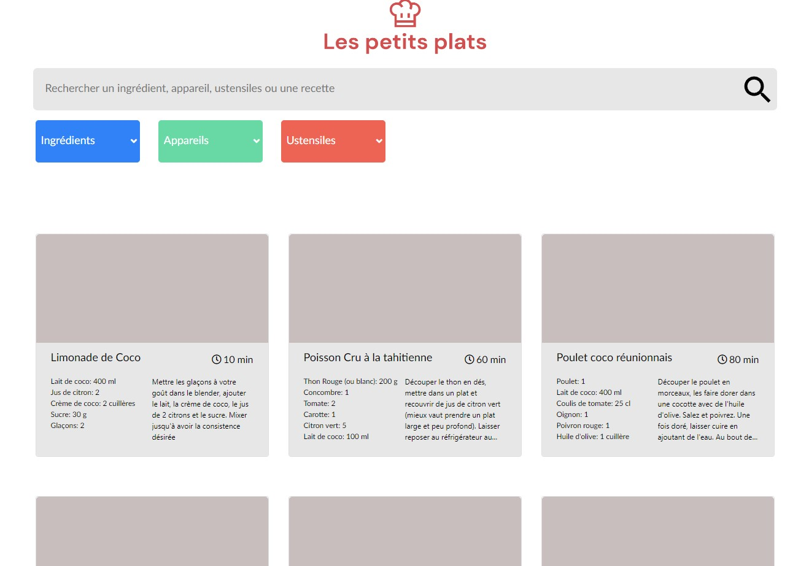

# Openclassrooms - Petits Plats solution

This is a solution to the Project 7 - openclassrooms "formation Frontend React - Javascript".

## Table of contents

- [Overview](#overview)
  - [The challenge](#the-challenge)
  - [Screenshot](#screenshot)
  - [Links](#links)
- [My process](#my-process)
  - [Built with](#built-with)
  - [What I learned](#what-i-learned)
- [Author](#author)

## Overview

### The challenge

Integration project from figma, Responsive , working on search scripts and custom dropdown

### Screenshot

### Links

- Solution URL: [github](https://github.com/denis-farkas/DenisFarkas_7_15012022)
- Live Site URL: [vercel](https://petitsplats-iu5reifw3-denis-farkas.vercel.app/)

## My process

### Built with

- Semantic HTML5 markup
- Flexbox
- Desktop-first workflow

### What I learned

javascript imbricated Search and custom dropdown

## Author

- Website - [Portfolio](https://denis-farkas.students-laplateforme.io/)
- Frontend Mentor - [@denis-farkas](https://www.frontendmentor.io/profile/denis-farkas)
